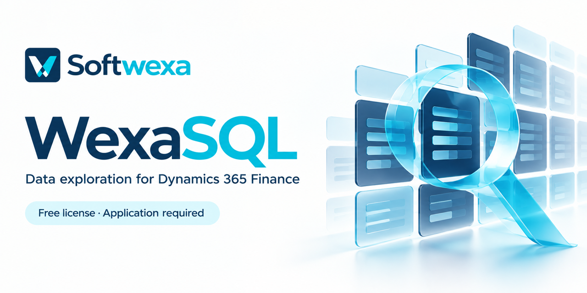
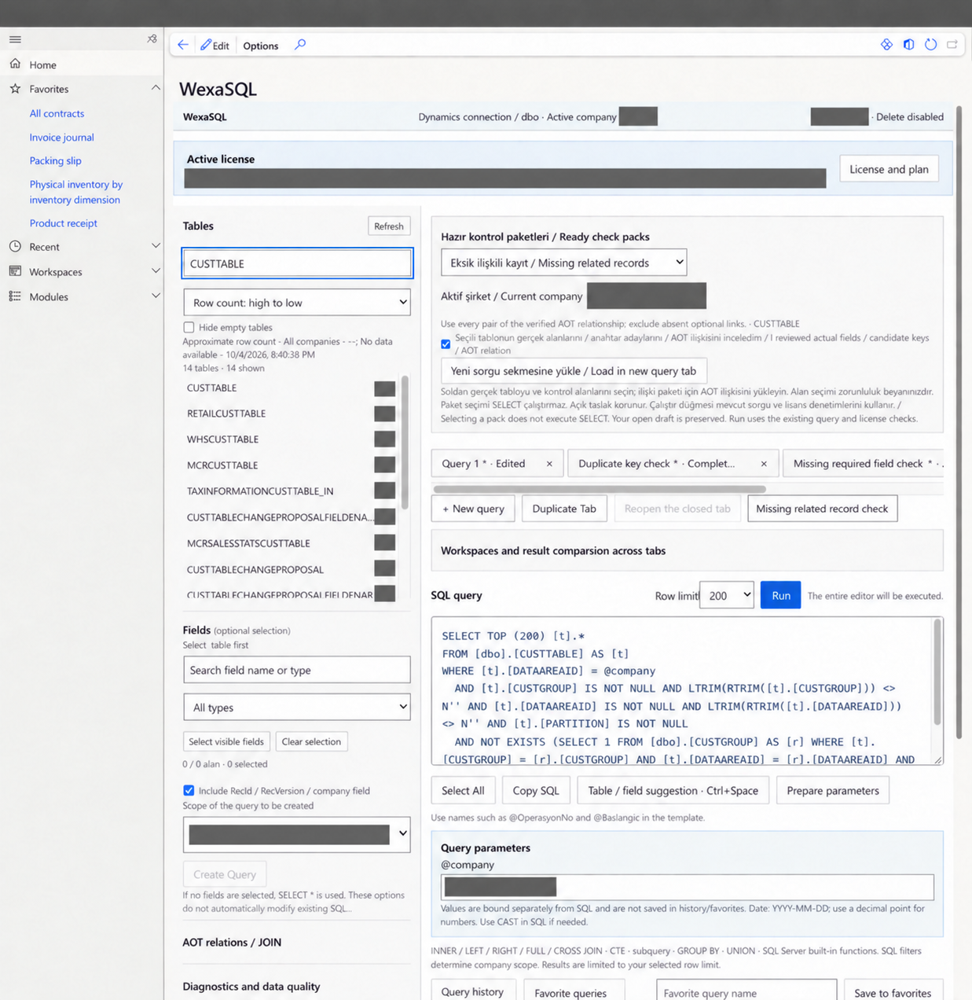

# WexaSQL for Microsoft Dynamics 365 Finance

A native **SELECT query and data exploration workspace** for Dynamics 365 Finance. WexaSQL helps ERP support teams and D365 developers prepare queries, inspect results and review business data in the Finance environment.

**[Apply for a Free license](https://www.softwexa.com/contact/?product=wexasql&service=WexaSQL%20Free%20license%20application)** · [Product overview](https://www.softwexa.com/products/wexasql/) · [Evaluation guide](https://www.softwexa.com/docs/wexasql/) · [Request a demo](https://www.softwexa.com/demos/wexasql/)

> **Free license application required.** Submit a request for WexaSQL. Softwexa reviews the application and confirms the product-specific tenant grant before access is activated.

## Product screenshots

SELECT workspace and ready data-check templates in the development installation. Company identifiers, user context, private license details and company-specific counts are redacted. Standard Dynamics 365 table and field names remain visible.

*Redacted development screenshot. Open the image to inspect the full-size interface.*

## Explore Finance data with a clear query boundary

- **SELECT query workspace:** prepare queries and inspect returned fields and rows.
- **Data exploration:** review metadata and results within the agreed access and company context.
- **Multi-table query evaluation:** the development candidate includes INNER, LEFT, RIGHT, FULL OUTER and CROSS JOIN.
- **CSV export evaluation:** review result export in the proposed package using anonymized sample data.
- **Controlled record changes:** evaluate a separate prepare-and-commit workflow with permitted fields, role and company checks, audit records and conflict handling.

The query editor is SELECT-only. Arbitrary UPDATE and DELETE statements are outside its scope. Record changes follow their own explicit workflow.

## Who is WexaSQL for?

| Team | Evaluation focus |
| --- | --- |
| ERP support teams | Investigate a data question and review the relevant records and fields. |
| Dynamics 365 developers | Inspect SELECT and JOIN behavior in the evaluated Finance package. |
| ERP consultants | Prepare a repeatable data review with agreed permissions and company context. |

Bring one representative data question, such as investigating duplicate references or incomplete fields. Use anonymized table and field names so the evaluation can focus on the query your team needs.

## Get started with a Free license

1. **[Submit your Free license application](https://www.softwexa.com/contact/?product=wexasql&service=WexaSQL%20Free%20license%20application)** with your name, company, work email, Finance version and intended use.
2. **Confirm the product and tenant scope** with Softwexa, including the Free capabilities available for your evaluation.
3. **Receive the agreed package and setup guidance** after review, then complete installation and runtime checks in the agreed environment.

Use the [application guide and message template](./FREE-LICENSE.md) to prepare your request. A GitHub account, repository clone or demo request does not issue a license key.

## Free and Pro licensing

WexaSQL uses **Free / Pro licensing for a registered tenant**. The enabled capabilities, limits, compatible versions and support scope are confirmed for the proposed grant. Apply for Free access first; describe any additional requirements if you want to discuss Pro.

**Product software is supplied separately under the agreed Softwexa licensing terms.** This repository publishes documentation and brand assets.

## Evaluation status

WexaSQL is in development evaluation. The native model has build evidence; JOIN and CSV features belong to the local development candidate. Customer packaging, clean installation, license delivery and authenticated runtime acceptance must be completed for the agreed delivery.

See the [current evaluation and deployment guide](https://www.softwexa.com/docs/wexasql/) before planning operational use.

## Resources and support

- [WexaSQL product page](https://www.softwexa.com/products/wexasql/)
- [Evaluation and deployment documentation](https://www.softwexa.com/docs/wexasql/)
- [Arrange a scoped demo](https://www.softwexa.com/demos/wexasql/)
- [Product support](https://www.softwexa.com/support/?product=wexasql#support-request)
- [WexaFlow workflow workspace](https://github.com/softwexa/wexaflow)

For license applications, use the private website form or **[hello@softwexa.com](mailto:hello@softwexa.com?subject=WexaSQL%20Free%20license%20application)**. For support, read [SUPPORT.md](./SUPPORT.md).

---

Built by **[Softwexa](https://www.softwexa.com)** — business software, Dynamics 365 Finance & Operations, X++ development and ERP integration.

[LinkedIn](https://www.linkedin.com/company/softwexa/) · [YouTube](https://www.youtube.com/@softwexa_com) · [X](https://x.com/softwexa_com)

